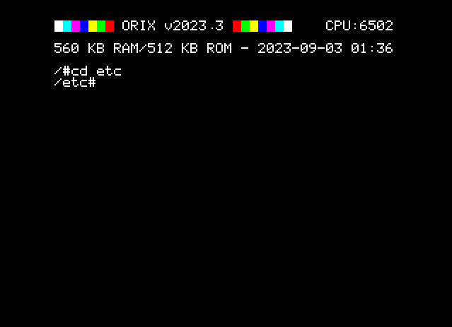

# cd

## INTRODUCTION

Change directory

## SYNOPSYS

+ cd DIRECTORY

## EXAMPLES

+ cd /usr/bin
+ cd ..
+ cd /

## SOURCE

https://github.com/orix-software/shell/blob/master/src/commands/cd.asm

## Images

