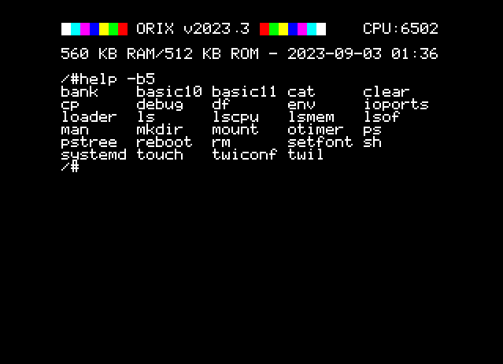

# help

## Introduction

Display commands stored in a bank

## SYNOPSYS

+ help

### Displays all commands from bank 5

+ help -b5

## DESCRIPTION

+ No parameter : Displays all internals shell command
+ bX parameter : Displays all internals commands in bank X

## SOURCE

https://github.com/orix-software/shell/blob/master/src/commands/help.asm

