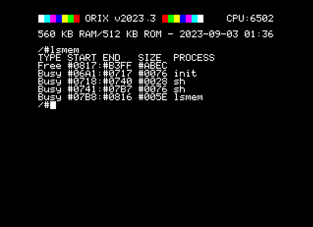

# lsmem

## Introduction

Displays malloc table

## SYNOPSYS

```bash
lsmem
```

## DESCRIPTION

Displays malloc table. Free chunks and busy chuncks are displayed with ranges, and process name

## EXAMPLES

+ lsmem

## SOURCE

https://github.com/orix-software/shell/blob/master/src/commands/lsmem.asm


