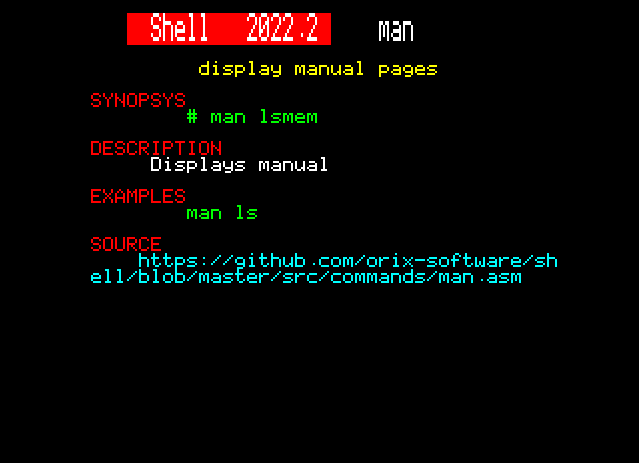

# man

## Introduction

display manual pages

## SYNOPSYS

+ man lsmem

## DESCRIPTION

Displays manual. All .hlp files are located in /usr/share/man/. It manages multiples text screen (if .hlp is bigger than a screen when space is pressed, it switch to next page).

## Keys

+ SPACE to switch to next page

+ ESC to exit

## EXAMPLES

+ man ls

## SOURCE

https://github.com/orix-software/shell/blob/master/src/commands/man.asm
