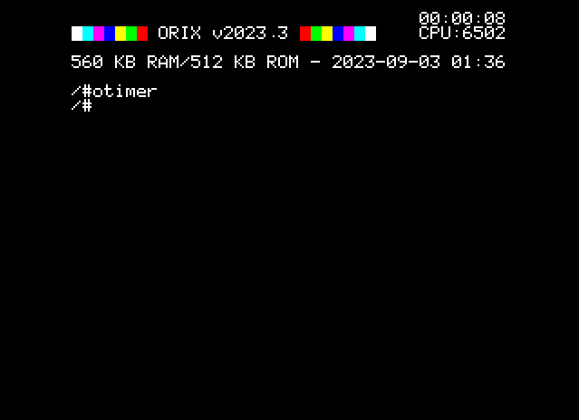

# otimer

## Introduction

Display timer since the Oric is power on

## SYNOPSYS

+ otimer

## NOTES

Each time Oric reboots, this timer is reset.

## SOURCE

https://github.com/orix-software/shell/blob/master/src/commands/otimer.asm
